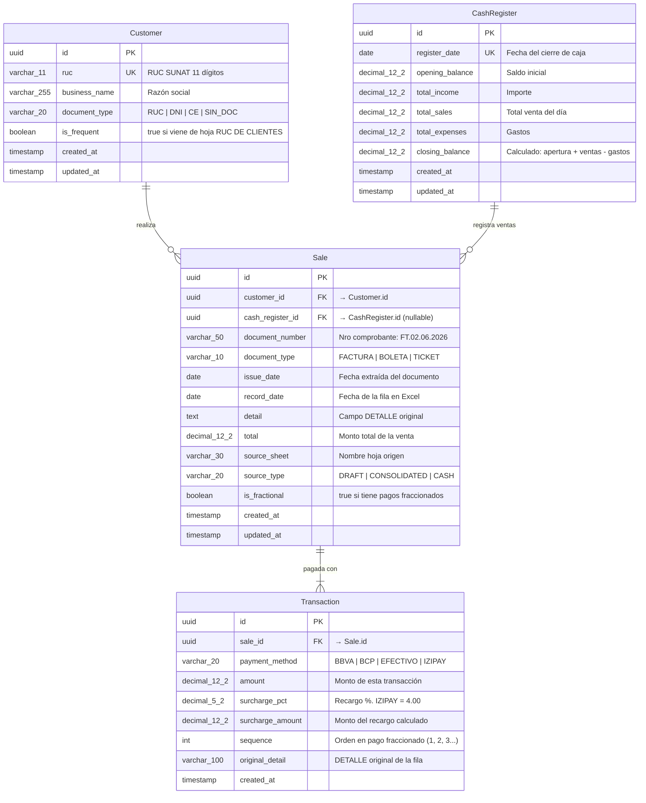

# Modelo de Base de Datos Relacional — GOLTEX S.A.C.

> Propuesta de normalización del historial Excel legado hacia un modelo relacional
> que soporte ventas, transacciones, clientes y caja diaria.

---

## 1. Diagrama Entidad-Relación



---

## 2. DDL Conceptual (PostgreSQL)

```sql
-- ═══════════════════════════════════════════════════════════════
-- TABLA: customers — Maestro de Clientes
-- Origen: Hoja "RUC DE CLIENTES" + clientes descubiertos en ventas
-- ═══════════════════════════════════════════════════════════════
CREATE TABLE customers (
    id            UUID PRIMARY KEY DEFAULT gen_random_uuid(),
    ruc           VARCHAR(11) UNIQUE,
    business_name VARCHAR(255) NOT NULL DEFAULT 'CLIENTE VARIOS',
    document_type VARCHAR(20)  NOT NULL DEFAULT 'SIN_DOC'
                  CHECK (document_type IN ('RUC', 'DNI', 'CE', 'SIN_DOC')),
    is_frequent   BOOLEAN      NOT NULL DEFAULT FALSE,
    created_at    TIMESTAMPTZ  NOT NULL DEFAULT NOW(),
    updated_at    TIMESTAMPTZ  NOT NULL DEFAULT NOW()
);

-- Índice para búsqueda por razón social
CREATE INDEX idx_customers_business_name ON customers (business_name);

-- Cliente sentinela para ventas sin identificar
INSERT INTO customers (id, ruc, business_name, document_type, is_frequent)
VALUES ('00000000-0000-0000-0000-000000000000', NULL, 'CLIENTE VARIOS', 'SIN_DOC', FALSE);


-- ═══════════════════════════════════════════════════════════════
-- TABLA: cash_registers — Caja Diaria
-- Origen: Hoja "CAJA"
-- ═══════════════════════════════════════════════════════════════
CREATE TABLE cash_registers (
    id              UUID PRIMARY KEY DEFAULT gen_random_uuid(),
    register_date   DATE         NOT NULL UNIQUE,
    opening_balance DECIMAL(12,2) NOT NULL DEFAULT 0,
    total_income    DECIMAL(12,2) NOT NULL DEFAULT 0,
    total_sales     DECIMAL(12,2) NOT NULL DEFAULT 0,
    total_expenses  DECIMAL(12,2) NOT NULL DEFAULT 0,
    closing_balance DECIMAL(12,2) GENERATED ALWAYS AS 
                    (opening_balance + total_sales - total_expenses) STORED,
    created_at      TIMESTAMPTZ  NOT NULL DEFAULT NOW(),
    updated_at      TIMESTAMPTZ  NOT NULL DEFAULT NOW()
);


-- ═══════════════════════════════════════════════════════════════
-- TABLA: sales — Registro de Ventas
-- Origen: Todas las hojas excepto "RUC DE CLIENTES" y "CAJA"
-- ═══════════════════════════════════════════════════════════════
CREATE TABLE sales (
    id               UUID PRIMARY KEY DEFAULT gen_random_uuid(),
    customer_id      UUID         NOT NULL REFERENCES customers(id),
    cash_register_id UUID         REFERENCES cash_registers(id),
    document_number  VARCHAR(50),
    document_type    VARCHAR(10)  NOT NULL DEFAULT 'TICKET'
                     CHECK (document_type IN ('FACTURA', 'BOLETA', 'TICKET')),
    issue_date       DATE,
    record_date      DATE         NOT NULL,
    detail           TEXT,
    total            DECIMAL(12,2) NOT NULL DEFAULT 0,
    source_sheet     VARCHAR(30)  NOT NULL,
    source_type      VARCHAR(20)  NOT NULL
                     CHECK (source_type IN ('DRAFT', 'CONSOLIDATED', 'CASH')),
    is_fractional    BOOLEAN      NOT NULL DEFAULT FALSE,
    created_at       TIMESTAMPTZ  NOT NULL DEFAULT NOW(),
    updated_at       TIMESTAMPTZ  NOT NULL DEFAULT NOW()
);

CREATE INDEX idx_sales_customer_id ON sales (customer_id);
CREATE INDEX idx_sales_record_date ON sales (record_date);
CREATE INDEX idx_sales_document_number ON sales (document_number);
CREATE INDEX idx_sales_source_type ON sales (source_type);


-- ═══════════════════════════════════════════════════════════════
-- TABLA: transactions — Transacciones de Pago
-- Origen: Derivada de cada fila de venta + pagos fraccionados
-- ═══════════════════════════════════════════════════════════════
CREATE TABLE transactions (
    id               UUID PRIMARY KEY DEFAULT gen_random_uuid(),
    sale_id          UUID         NOT NULL REFERENCES sales(id) ON DELETE CASCADE,
    payment_method   VARCHAR(20)  NOT NULL
                     CHECK (payment_method IN ('BBVA', 'BCP', 'EFECTIVO', 'IZIPAY')),
    amount           DECIMAL(12,2) NOT NULL DEFAULT 0,
    surcharge_pct    DECIMAL(5,2) NOT NULL DEFAULT 0,
    surcharge_amount DECIMAL(12,2) NOT NULL DEFAULT 0,
    sequence         INTEGER      NOT NULL DEFAULT 1,
    original_detail  VARCHAR(100),
    created_at       TIMESTAMPTZ  NOT NULL DEFAULT NOW()
);

CREATE INDEX idx_transactions_sale_id ON transactions (sale_id);
CREATE INDEX idx_transactions_payment_method ON transactions (payment_method);
```

---

## 3. Tipos TypeScript Equivalentes (Entidades)

```typescript
/** Entidad de dominio: Cliente */
interface CustomerEntity {
  readonly id: string;
  readonly ruc: string | null;
  readonly businessName: string;
  readonly documentType: 'RUC' | 'DNI' | 'CE' | 'SIN_DOC';
  readonly isFrequent: boolean;
  readonly createdAt: Date;
  readonly updatedAt: Date;
}

/** Entidad de dominio: Venta */
interface SaleEntity {
  readonly id: string;
  readonly customerId: string;
  readonly cashRegisterId: string | null;
  readonly documentNumber: string | null;
  readonly documentType: 'FACTURA' | 'BOLETA' | 'TICKET';
  readonly issueDate: Date | null;
  readonly recordDate: Date;
  readonly detail: string | null;
  readonly total: number;
  readonly sourceSheet: string;
  readonly sourceType: 'DRAFT' | 'CONSOLIDATED' | 'CASH';
  readonly isFractional: boolean;
  readonly transactions: readonly TransactionEntity[];
  readonly createdAt: Date;
  readonly updatedAt: Date;
}

/** Entidad de dominio: Transacción de Pago */
interface TransactionEntity {
  readonly id: string;
  readonly saleId: string;
  readonly paymentMethod: 'BBVA' | 'BCP' | 'EFECTIVO' | 'IZIPAY';
  readonly amount: number;
  readonly surchargePct: number;
  readonly surchargeAmount: number;
  readonly sequence: number;
  readonly originalDetail: string | null;
  readonly createdAt: Date;
}

/** Entidad de dominio: Caja Diaria */
interface CashRegisterEntity {
  readonly id: string;
  readonly registerDate: Date;
  readonly openingBalance: number;
  readonly totalIncome: number;
  readonly totalSales: number;
  readonly totalExpenses: number;
  readonly closingBalance: number;
  readonly createdAt: Date;
  readonly updatedAt: Date;
}
```

---

## 4. Diccionario de Datos

### `customers`

| Campo | Tipo | Nullable | Descripción |
|-------|------|----------|-------------|
| `id` | UUID | NO | Identificador único |
| `ruc` | VARCHAR(11) | SÍ | RUC de SUNAT. Null para CLIENTE VARIOS |
| `business_name` | VARCHAR(255) | NO | Razón social. Default: `'CLIENTE VARIOS'` |
| `document_type` | VARCHAR(20) | NO | Tipo de documento: RUC, DNI, CE, SIN_DOC |
| `is_frequent` | BOOLEAN | NO | `true` si viene de la hoja "RUC DE CLIENTES" |

### `sales`

| Campo | Tipo | Nullable | Descripción |
|-------|------|----------|-------------|
| `id` | UUID | NO | Identificador único |
| `customer_id` | UUID FK | NO | Referencia al cliente |
| `cash_register_id` | UUID FK | SÍ | Referencia a la caja del día (si aplica) |
| `document_number` | VARCHAR(50) | SÍ | Nro de comprobante. Ej: `FT.02.06.2026` |
| `document_type` | VARCHAR(10) | NO | FACTURA, BOLETA o TICKET |
| `issue_date` | DATE | SÍ | Fecha extraída del documento (puede diferir de record_date) |
| `record_date` | DATE | NO | Fecha de la fila en el Excel |
| `detail` | TEXT | SÍ | Campo DETALLE original del Excel |
| `total` | DECIMAL(12,2) | NO | Monto total de la venta |
| `source_sheet` | VARCHAR(30) | NO | Nombre de la hoja de origen |
| `source_type` | VARCHAR(20) | NO | DRAFT, CONSOLIDATED, o CASH |
| `is_fractional` | BOOLEAN | NO | `true` si la venta tiene pagos divididos |

### `transactions`

| Campo | Tipo | Nullable | Descripción |
|-------|------|----------|-------------|
| `id` | UUID | NO | Identificador único |
| `sale_id` | UUID FK | NO | Referencia a la venta padre |
| `payment_method` | VARCHAR(20) | NO | BBVA, BCP, EFECTIVO, IZIPAY |
| `amount` | DECIMAL(12,2) | NO | Monto de esta transacción |
| `surcharge_pct` | DECIMAL(5,2) | NO | Porcentaje de recargo. IZIPAY = 4.00 |
| `surcharge_amount` | DECIMAL(12,2) | NO | Monto del recargo calculado |
| `sequence` | INTEGER | NO | Orden dentro de pago fraccionado (1, 2, 3…) |
| `original_detail` | VARCHAR(100) | SÍ | DETALLE original de la fila del Excel |

### `cash_registers`

| Campo | Tipo | Nullable | Descripción |
|-------|------|----------|-------------|
| `id` | UUID | NO | Identificador único |
| `register_date` | DATE | NO | Fecha del cierre de caja (unique) |
| `opening_balance` | DECIMAL(12,2) | NO | Saldo inicial del día |
| `total_income` | DECIMAL(12,2) | NO | Importe (ingresos varios) |
| `total_sales` | DECIMAL(12,2) | NO | Total ventas del día |
| `total_expenses` | DECIMAL(12,2) | NO | Gastos del día |
| `closing_balance` | DECIMAL(12,2) | NO | Calculado: apertura + ventas - gastos |

---

## 5. Mapeo de Reglas de Negocio

### 5.1 Fechas Asíncronas

```
Excel:  DOCUMENTO = "FT.02.06.2026"
        FECHA     = 2026-06-05 (la fila está en otra fecha)

BD:     Sale.document_number = "FT.02.06.2026"
        Sale.document_type   = "FACTURA"
        Sale.issue_date      = 2026-06-02  ← extraída del documento
        Sale.record_date     = 2026-06-05  ← fecha de la fila
```

### 5.2 Pagos Fraccionados (Límites Yape/Plin)

```
Excel (3 filas consecutivas):
  DOCUMENTO          BBVA    BCP    EFECTIVO   TOTAL
  BV.22.06.26         0     500       0        500
  BV.22.06.26         0     500       0        500  
  BV.22.06.26         0     200       0        200

BD (1 Sale + 3 Transactions):
  Sale: total = 1200, is_fractional = true
  Transaction 1: BCP, amount=500, sequence=1
  Transaction 2: BCP, amount=500, sequence=2
  Transaction 3: BCP, amount=200, sequence=3
```

### 5.3 Lógica IZIPAY

```
Excel:  DETALLE = "IZIPAY"  |  BCP = 150.00  |  TOTAL = 150.00

BD:     Transaction.payment_method  = "IZIPAY"
        Transaction.amount          = 150.00
        Transaction.surcharge_pct   = 4.00
        Transaction.surcharge_amount = 6.00

Export: DETALLE = "IZIPAY"  |  BCP = 150.00  (monto en columna BCP)
```

### 5.4 Cliente Vacío

```
Excel:  NOMBRE Y/O RAZON SOCIAL = "" | null | undefined

BD:     Sale.customer_id → Customer sentinela (CLIENTE VARIOS)
```

### 5.5 Hoja6 sin columna DOCUMENTO

```
Excel Hoja6:  FECHA | NOMBRE Y/O RAZON SOCIAL | DETALLE | BBVA | BCP | EFECTIVO | TOTAL
              (sin columna DOCUMENTO)

BD:     Sale.document_number = null
        Sale.document_type   = "TICKET"
        Sale.issue_date      = null
```
